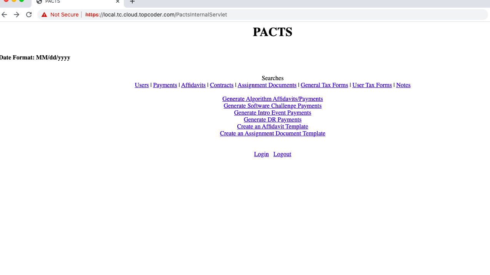
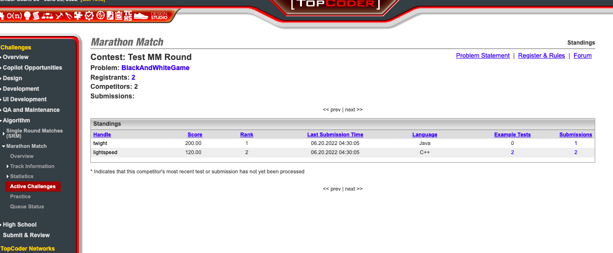
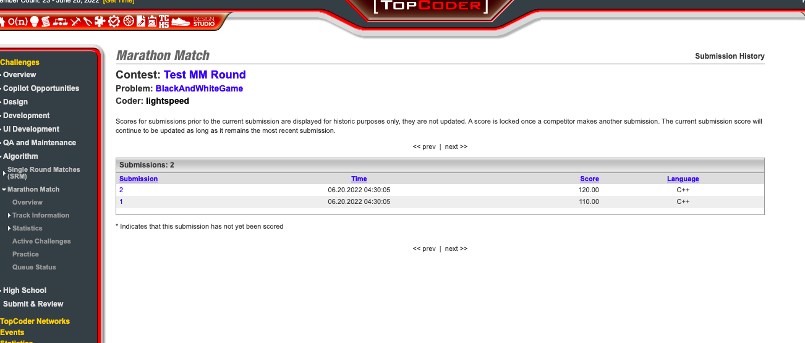
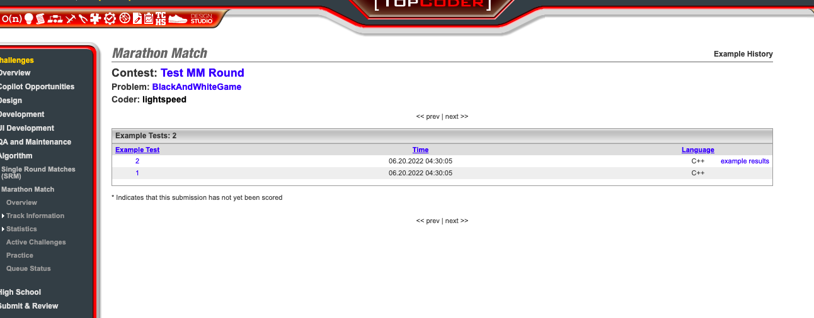
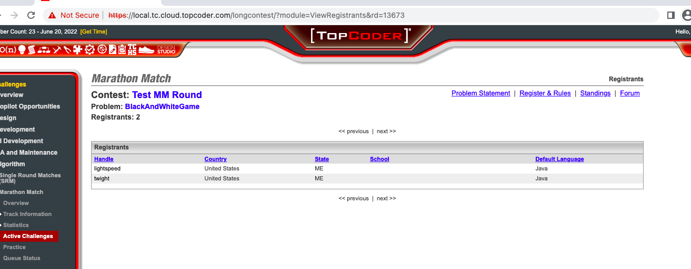
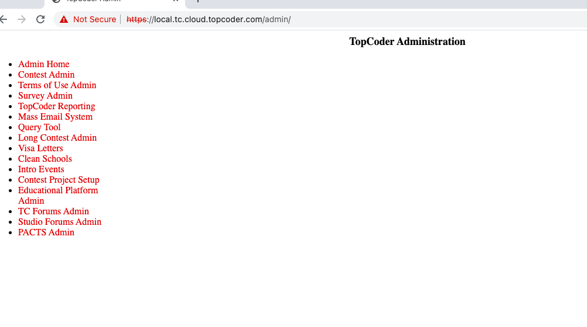
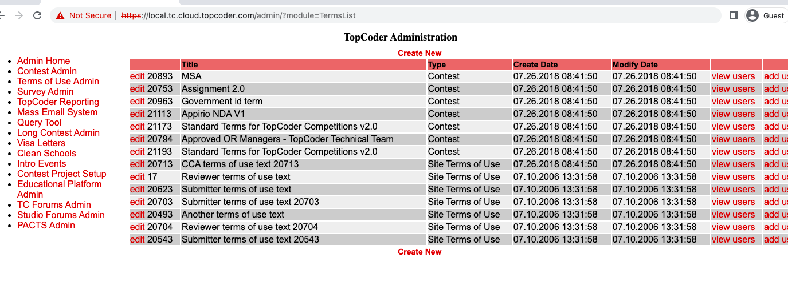
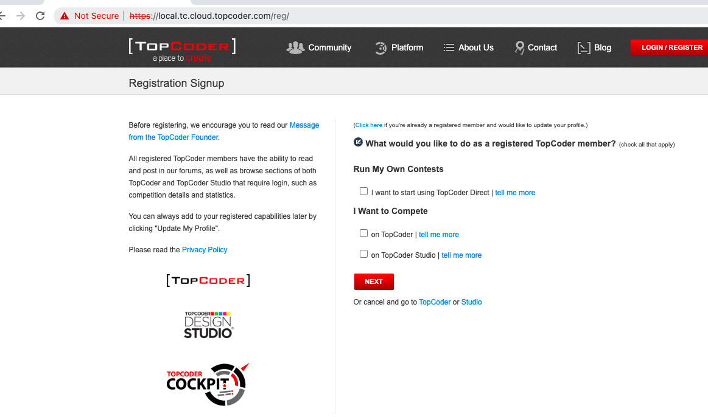
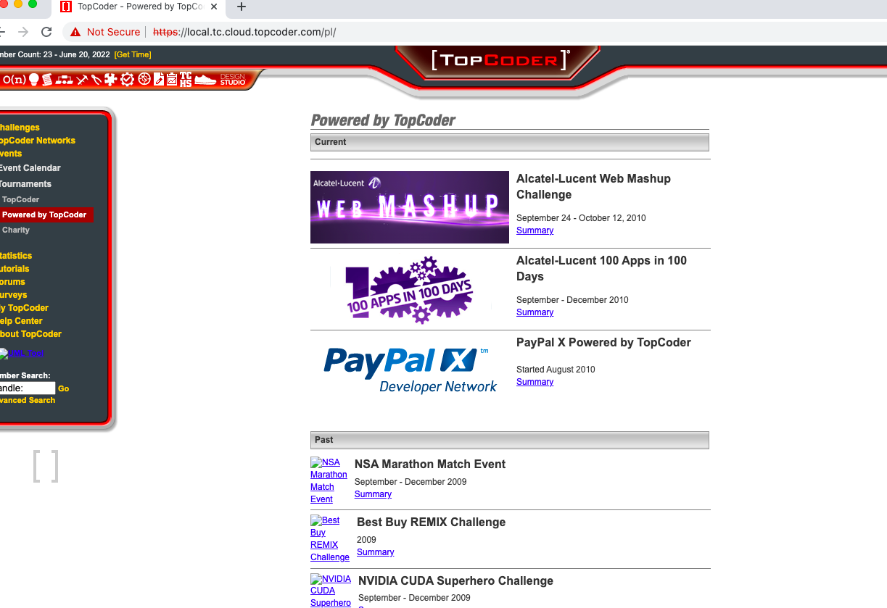

# Legacy TC Website Local Deployment

Legacy TC website involve some require services i.e: Informix DB Server, LDAP, HTTP Server, Jboss Application Server, etc. So the most effordable way to setup locally is by utilizing on inside docker. We already done this on this [repo](https://github.com/appirio-tech/tc-common-tutorials/tree/master/docker/tc-website) But it won't works because it used JDK8, and Legacy have issues on JDK > 7. 

On guide, we'll setup Docker (based on above [repo](https://github.com/appirio-tech/tc-common-tutorials/tree/master/docker/tc-website)) to deploy legacy TC Website on it.
This setup is for `Linux, Mac and Windows`.

## Tech Stack
- J2EE JDK 7
- Jboss 4.0.4
- informix 11
- Open LDAP
- Apache 2.2
- Mod_JK 1.2
- Redis 3.2 (Optional as replacement of internal TC Cache)

## Code structure
There are some applications on tc-website repo. But all codes are on single code base.
If you want to track code for an application, you can trace it on build file by tracing how the war file was built

For instance `tc.war` this is for `/tc`, check target `war-tc` on `build_tc.xml` file.

## Requirement
- Docker Engine >= 17
- Docker Compose >= 1.20

## Environment Variables
You can set this on `docker/env.sh` (Linux/mac)

| Variable        | Value |
|-----------------|-------|
| TC_WEBSITE_HOME | the root directory of the legacy tc-website codebase and all its required repos. |
| JBOSS_DEPLOYMENT_DIR | the directory to put the jboss and the created wars |


Both directories above are local directory on host that we'll mount to container later.
After changing the file, you can run
`source env.sh`. You need to run this command on terminal you're working on.

For windows user you can use setx command
```
setx TC_WEBSITE_HOME <full path to root folder of code base>
setx JBOSS_DEPLOYMENT_DIR <full path deployment folder>
```


## Prepare TC-Website Codebase
```
cd $TC_WEBSITE_HOME

git clone https://github.com/topcoder-platform/tc-website tc-website;
git clone https://github.com/topcoder-platform/tc-website-external-artifacts external-artifacts;
git clone https://github.com/topcoder-platform/tc-website-glue glue;
git clone https://github.com/topcoder-platform/tc-website-shared shared;
git clone https://github.com/topcoder-platform/tc-website-static;
git clone https://github.com/appirio-tech/temp-maven-repo;
```

## Configuration
Please make some changes on tc-website repo:

| File                     | Properties                     |
|--------------------------|--------------------------------|
|resources/LDAP.properties | host=tc-ldap                   |
|resources/cache.properties| redis.uri=redis://tc-cache:6379|


> NOTE : There is issue on TC website MemberPhotoRemovalServlet configuration.
> For now let's comment out this servlet.
> Open `resources/tc/applicationContext.xml`
> Comment out bean id="photoRemovalServlet" section L12-47
> 

# Hosts file update
Please add this line to your `hosts` file (Linux/Mac on `/etc/hosts`)
```
127.0.0.1 local.tc.cloud.topcoder.com
```

# Build Base Image
You only need to run this comand once
```
docker-compose build tc-base
```

# Build And Deploy Command
These commands should be run on same directory of `docker-compose.yml`

Build TC-Website
```
docker-compose run build-tc-website
```
It takes time to deploy this. You'll see build result on `JBOSS_DEPLOYMENT_DIR` directory.

Deploy And Run TC-Website
```
docker-compose up run-tc-website tc-httpd
```

Checking jboss log
`docker-compose logs -f run-tc-website`


## Test Data

Insert some test data into informix database. Also currently the database misses *user_sso_login* table, it needs be created:

```shell
docker cp test_files/mm_test_data.sql iif_innovator_c:/tmp
docker exec -it iif_innovator_c bash
dbaccess informixoltp /tmp/mm_test_data.sql
exit
```

### Application List
> Note most of link on this legacy page has been setup to redirect to new TC website.

TC Landing page

1. The landing page
https://local.tc.cloud.topcoder.com/tc - accept the self-signed SSL certificate.

2. Login page
https://local.tc.cloud.topcoder.com/tc?&module=Login - login with `heffan/password`.

3. Change to old theme. Don't forget to click save. 
https://local.tc.cloud.topcoder.com/tc?module=EditTheme


PACT page
1. Member
https://local.tc.cloud.topcoder.com/PactsMemberServlet?module=PaymentHistory&full_list=false

2. Internal
https://local.tc.cloud.topcoder.com/PactsInternalServlet



Marathon Match WAR:

1. Member Standing
https://local.tc.cloud.topcoder.com/longcontest/?module=ViewStandings&rd=13673

2. Submission history
https://local.tc.cloud.topcoder.com/longcontest/?module=ViewSubmissionHistory&cr=124834&rd=13673&compid=2020


3. Example history
https://local.tc.cloud.topcoder.com/longcontest/?module=ViewExampleHistory&cr=124834&rd=13673&compid=2020



4. Registrants
https://local.tc.cloud.topcoder.com/longcontest/?module=ViewRegistrants&rd=13673


Query WAR:
https://local.tc.cloud.topcoder.com/query/query


Admin WAR:
1. https://local.tc.cloud.topcoder.com/admin/

2. https://local.tc.cloud.topcoder.com/admin/?module=TermsList


Email WAR:
https://local.tc.cloud.topcoder.com/email/


Reg WAR:
https://local.tc.cloud.topcoder.com/reg/


Private Label WAR:
https://local.tc.cloud.topcoder.com/pl/


Note that you may receive HTTPS certificate warnings, just ignore it and proceed.
And you can click around to try the other pages.
